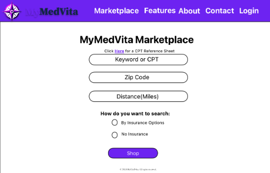
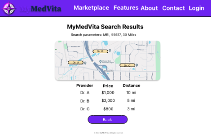
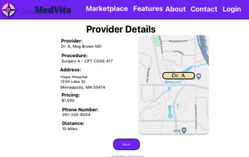
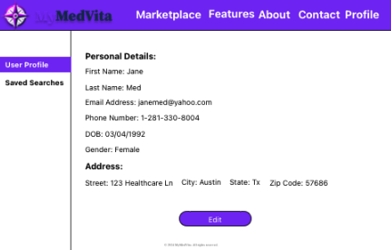
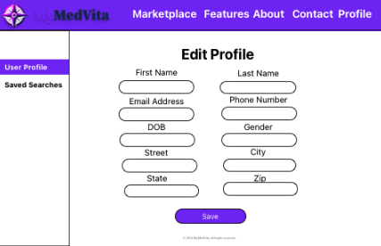
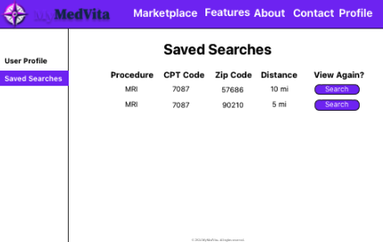

MyMedVita Web Application

<!-- PROJECT LOGO -->
 

  

  <h3 align="center">MyMedVita README</h3>

  

    Please see below for detail guide on this application.
     
    <a href="https://github.com/AlvinGraham/MyMedVita"><strong>Explore the docs »</strong></a>
     
     
    <a href="https://github.com/AlvinGraham/MyMedVita">View Demo</a>
    ·
    <a href="https://github.com/AlvinGraham/MyMedVita/issues">Request Feature</a>
  

<!-- TABLE OF CONTENTS -->

  
Table of Contents

  <ol>
    <li>
      <a href="#about-the-project">About The Project</a>
    </li>
    <li>
      <a href="#installation">Getting Started</a>
      <ul>
        <li><a href="#prerequisites">Prerequisites</a></li>
        <li><a href="#getting-started">Installation</a></li>
      </ul>
    </li>
    <li><a href="#usage">Usage</a></li>
    <li><a href="#roadmap">Roadmap</a></li>
    <li><a href="#contributing">Contributing</a></li>
    <li><a href="#license">License</a></li>
    <li><a href="#contact">Contact</a></li>
    <li><a href="#acknowledgments">Acknowledgments</a></li>
  </ol>

<!-- ABOUT THE PROJECT -->

## About The Project

### Description

The MyMedVita web application is a website designed to make prices and options for medical procedures more accessible and transparent to patients. Users can search for a specific medical procedure within their area and see a variety of providers that offer that procedure along with details such as provider name/specialty, negotiated price of procedure(with or without insurance), distance to the provider, provider address, and provider phone number.

(<a href="#readme-top">back to top</a>)

<!-- Installation -->

## Installation

How do you get your application up and running? This is a step by step list for how another developer could get this project up and running. The good target audience in terms of knowledge, would be a fellow Primer from another cohort being able to spin up this project. Note that you do not need a paragraph here to intro Installation. It should be step-by-step.

If your application has secret keys (for example -- Twilio), make sure you tell them how to set that up, both in getting the key and then what to call it in the `.env` file.

(<a href="#readme-top">back to top</a>)

### Prerequisites

- [Node.js](https://nodejs.org/en/)
- [PostgreSQL](https://www.postgresql.org)
- [Nodemon](https://nodemon.io)
- [React Leaflet](https://react-leaflet.js.org)

### Getting Started

1. Create a database named `MyMedVita`,
2. The queries in the `database.sql` file are set up to create all the necessary tables and populate the needed data to allow the application to run correctly. The project is built on [Postgres](https://www.postgresql.org/download/), so you will need to make sure to have that installed. We recommend using [Postico](https://eggerapps.at/postico2/) to run those queries as that was used to create the queries,
3. Open up your editor of choice and run an `npm install`
4. Run `npm run server` in one terminal
5. Run `npm run client` in a separate terminal
6. The `npm run client` command will open up a new browser tab for you!

(<a href="#readme-top">back to top</a>)

<!-- USAGE -->

## Usage

<!-- How does someone use this application? Tell a user story here. -->

The navigation header bar will have global navigation links for all users (both authenticated and unauthenticated). Before a user logs in, the Navigation bar will display links to the About, Features, and Contact pages. Upon clicking on these links it will navigate the user to the said links.

    

Logon:
After a user logs in, the Navigation bar will display links to the Marketplace, Features, About, Contact, and Profile pages.

    

Landing Page:
The splash page is the first page users will see when navigating to the site. Users will be able to click on links; "Start Shopping" or "View Features" page.

    

Features:
The features page will show details about MyMedVita’s application features.

    

AboutPage:
The about page will show information about MyMedVita; founders, mission, and vision to users.

The Contact Page:
The Contact Page will allow users to enter their details in order to get in touch with someone from the MyMedVita team. Users will be able to enter their Name, Email, and a short message for questions or feedback.
Clicking the Submit button will send their message to support@mymedvita.com

Login Page:
The login page will allow users to enter their email address and password. Upon successful login, users will be navigated to the 1.8 MyMedVita Marketplace Page.
An unsuccessful login will alert the users via a span tag advising the user their login credentials were invalid.

Registration Page:
The Registration Page will allow users to enter their details to create an account.
The page wil collect: first name, last name, email address, password, password confirmation. These would be OPTIONAL: phone number, gender, DOB, Address.
Upon submission, users will navigate to the 1.8 MyMedVita Marketplace Page.

MarketPlace:
Users will input search parameters into a form which will collect a keyword (possibly use a searchable select), zip code, and distance as well as search type.

Selection of multiple or all insurers.

Clicking on "Click Here for a CPT Reference Sheet" will provide all the CPT codes and description.

    

Marketplace Results:
The search results page will list all results gathered from the marketplace search query:
-Provider
-Price
-Distance

Visual map of the area within the selected parameters by the user.
Note:
Provider HAS TO BE ORDERED in the following format: First Name Last Name, Credentials.

    

Providers Detail Page:
Clicking on the provider will render a details page of that provider.

The Provider Details Page will list all details for a specified provider
Results show: Provider, Procedure, Address, Price, Phone number, Distance, Map location

    

User Page and User Edit Page:
Allows the user to see the information and the edit page allows the user to edit that information.

    

    

Saved Searchers:
Allows users to see their saved searches for later reference

    

(<a href="#readme-top">back to top</a>)

## Built With

Node
Express
React
Redux
Postgresql
MaterialUI
API Docs
React Leaflet
Geocodio

## Acknowledgement

Thanks to [Prime Digital Academy](www.primeacademy.io) who equipped and helped us to make this application a reality.

## Support

If you have suggestions or issues, please email at:
[Nicole](nicolebarnhouse@gmail.com)
[Kevin](ksieracke@gmail.com)
[Jessica](jessiyang1996@gmail.com)
[Alvin](grah0071@gmail.com)
[Ryan] (cadium828@gmail.com)
[Sarith](Sarithseang82pro@gmail.com)
[Scott](gpak86@gmail.com)
